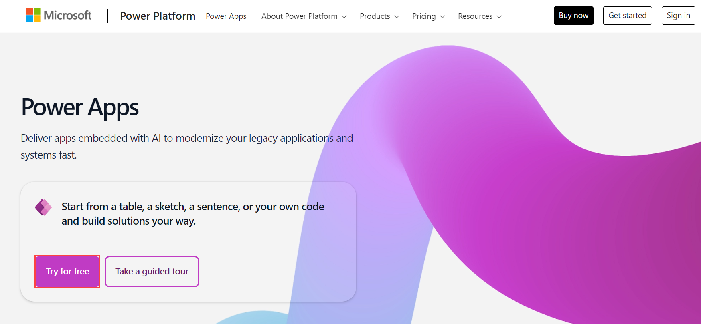
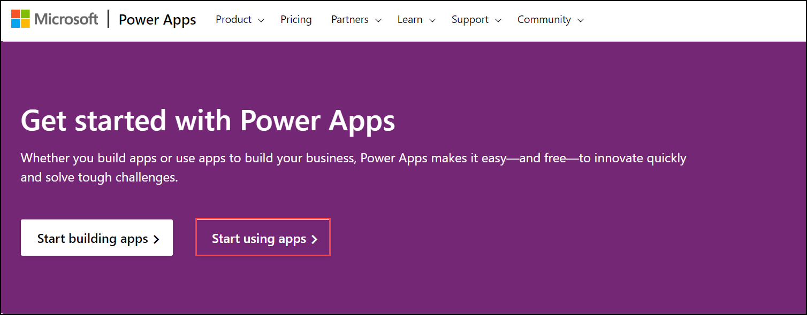

# Course Introduction
 
> - Common Data Service has been renamed to Microsoft Dataverse. You can refer to the following link for more details: `https://aka.ms/PAuAppBlog`
> - Some terminology in Microsoft Dataverse has been updated. For example, *entity* is now *table* and *field* is now *column*. For more details, navigate to: `https://go.microsoft.com/fwlink/?linkid=2147247`
 
## Lab 00: Validate-lab-environment
 
## Lab Scenario
 
In this lab, you will acquire a Power Platform trial tenant and access the Power Platform admin center. In the admin center, you will create an individual environment for use during the rest of the course. You will need **Microsoft 365 credentials** provided by the Authorized Lab Hoster, or otherwise.
 
## Lab Objectives
 
Though this lab, you will be able to complete and gain insights into the following exercises:
 
-  Exercise 1: Acquire a Power Platform trial tenant
-  Exercise 2: Create your environment
 
### Exercise 1: Acquire a Power Platform trial tenant

1. Inside the Lab VM search for **Microsoft Edge**.

1.  Navigate to [Power Apps](https://powerapps.microsoft.com/), select **Try for free**.

    

1. Scroll down and select **Start using apps>** and enter the email address from the provided Microsoft 365 credentials. Agree to the terms & conditions then select **Start your free trial**.

    

    

    >**Note:** If prompted for the email and password, enter your ODL credentials.

    >**Note:** On the **Welcome to Power Apps**, select the country **United States**, and select **Get started**.

    >**Note:** If you encounter an error: "Sorry, there's been a disconnect", you can follow the steps below. If not, you can continue to Exercise 2.

1. Navigate to Power Apps Maker Portal.
1. Select the Gear Icon (Settings) from top-right corner on the header of the page.
1. Select Plan(s) and verify if you have Power Apps Per User Plan Trial.
1. If you do not have the above license, repeat Exercise 1. Otherwise, proceed to Exercise 2.
  
### Exercise 2: Create your environment
 
In this exercise, you will create a **Practice** environment that you will use to do the majority of the lab work in this training.
 
#### Task 1 – Create environment
 
1.  Open a new browser tab and navigate to the Power Platform admin center `https://aka.ms/ppac` 

2.  Log in with your Microsoft 365 credentials, if prompted again.
 
3.  Skip the welcome tour by closing the prompt, or select **Get Started** to begin the tour and select **Next** through each prompt. At the end, select **Done** to finish the tour.
 
4.  Select **Environments** from the site navigation and select **+ New** from the toolbar.

    >**Note:** If the **AJ Practice** is already created, delete it and perform from the Step-04 again.

5.  For **Name**, enter `AJ Practice`

6.  For **Type**, select **Trial**. 

7.  Change the toggle on **Add a Dataverse data store?** to **Yes**. Leave all other selections as default and select **Next**.
 
8.  On the **Add Dataverse** tab, under **Security group** use the **+ Select** button, and under **Open access**, select **None**.

9.  Select **Done** and select **Save**.
 
10. In the list of environments, your **Practice** environment should now show as **Preparing**.
 
    Your practice environment will take a few minutes to provision. Refresh the **Environments** list if needed.
 
11. When your environment shows as **Ready**, select your **Practice** environment by selecting the ellipses next to the name to expand the drop-down menu and select **Settings**.
 
12. Explore the different areas in **Settings** that you are interested in but do not make any changes. 
