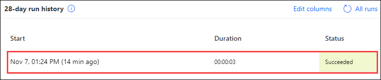
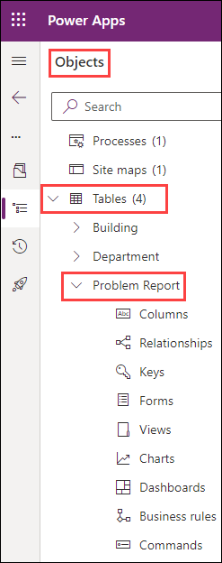
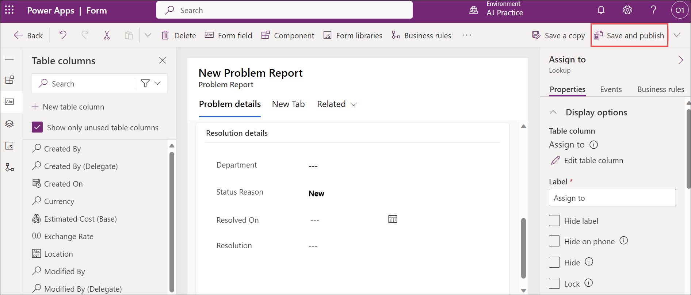
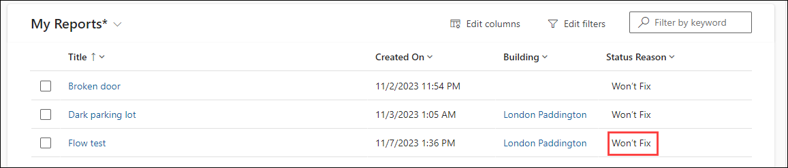
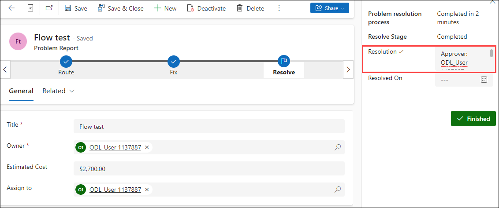
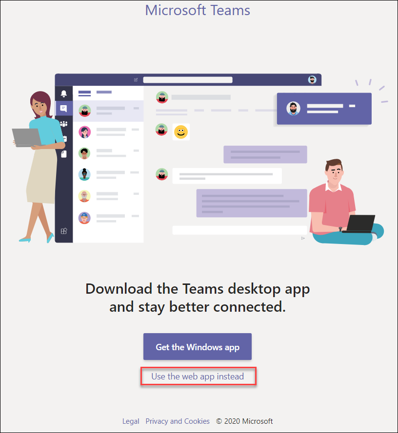
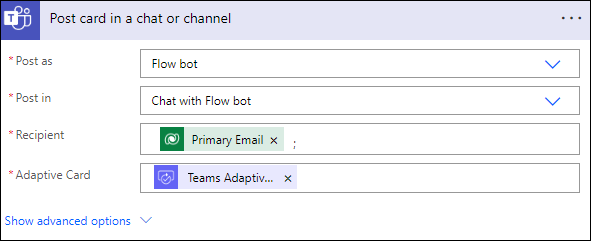
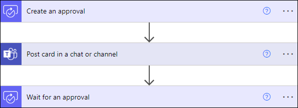
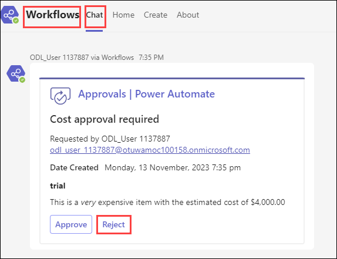
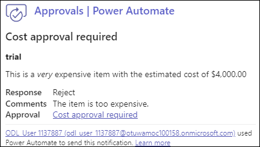

# Course Introduction

> - Common Data Service has been renamed to Microsoft Dataverse. [Learn more](https://aka.ms/PAuAppBlog)
> - Some terminology in Microsoft Dataverse has been updated. For example, *entity* is now *table* and *field* is now *column*. [Learn more](https://go.microsoft.com/fwlink/?linkid=2147247)

# Lab 04: Power Automate

In this lab, you will create Power Automate cloud flows to automate various parts of the Company 311 solution.

The following have been identified as requirements you must implement to complete the project: 

  - Escalation, approval, and execution process for urgent maintenance issues 

  - Notify reporting user about the issue status changes 

  - How to use a business rule to implement logic.

## Lab Objectives

In this lab, you will complete the following tasks:

- Exercise 1: Build notify flow
- Exercise 2: Build escalation flow
- Exercise 3: Send approval requests as adaptive card in Microsoft Teams(READ-ONLY)

## Prerequisites

* Must have completed **Lab 02.1: Data model and model-driven app**
* Must have completed **Lab 02.2: Business Process Flows and Business Rules**

## Things to consider before you begin

  - What is the most efficient way to identify urgent maintenance issues and escalate them

## Detailed steps  

### Exercise 1: Build notify flow

In this exercise, you create a flow that will notify the creator of a problem when the status changes.

#### Task 1: Create flow

In this task, you will create a flow that send notification when the status of problem report row changes.

1.  Navigate to the [Power Apps maker portal](https://make.powerapps.com/) and make sure you are in the correct environment.

2.  Select **Solutions** and open the **Company 311** solution.

    .png)

4.  Select **+ New (1)** > **Automation (2)** > **Cloud Flow (3)** > **Automated (4)**.

    .png)

5. Click on **Get Started** if the pop-up comes up.

    .png)

6.  Enter `when a row` (1) in the search box, then locate and select the **When a row is added, modified or deleted (2)** action from the **Microsoft Dataverse** connector. Select **Create (3)**.

    .png)

7. Select **Modified (1)** for **Change type**, select **Problem Reports (2)** for **Table name**, **Organization (3)** for **Scope** and expand **Show advanced options (4)**.
  
    .png)

8.  Enter `statuscode` for **Select columns** then select **… Menu** button of the trigger step.

9.  Select **Rename**.

10.  Rename the trigger step `When problem report status changes`

11.  Select **+ New step**.

12. Select **Connectors** tab and then select **Microsoft Dataverse**. Select **Get a row by ID**.

    .png)

    .png)

13. Select **Users** for **Table name**.

14. Select the **Row ID** field, go to the Dynamic pane, search for `created` and select **Created By (Value)** to add it.

    .png)

15. Select **Show advanced options** on the new step.

16. Enter `internalemailaddress` for **Select columns**.

    .png)
    
17. Select the **… Menu** button of the new step and select **Rename**.

18. Rename the step `Get problem creator`

19. Select **+ New step**.

20. Search for `send email` and select **Send an email (V2).**

    .png)

21. Select the **To** field and select the **Switch to Advanced Mode** arrows icon. Selecting this button toggles show/hide of the Dynamic content pane.

    .png)

22. Select the **Primary Email** field from the **Get problem creator** step.

    .png)

23. Enter `Problem report status change notification` for **Subject**.

24. Select the **Body** field.

25. Enter `The status of the problem you reported has changed.` and press the **[ENTER]** key.

26. Enter `Problem Title:` followed by a **[SPACE]**, go to the **Dynamic content** pane, search for `title` and select **Title**.

27. Press the **[ENTER]** key.

28. Enter `Current Status:` followed by a **[SPACE]**, go to the **Dynamic content** pane, select the **Expression** tab, paste the expression below, and select **OK**. This expression will show the label of the Status Reason instead of the value.

    `triggerOutputs()?['body/_statuscode_label']`

    .png)
    
29. Select the **… Menu** button of the new step and select **Rename**.

30. Rename the step to `Notify problem creator`
    
31. At the top of the page, change the flow name from **Untitled** to `Notify Problem Creator`

32. Select **Save** (2) and wait for the flow to be saved.

    .png)

33. Select the **🡠** button to go back to the previous page.

#### Task 2: Test the flow

In this task, you will test the Notify Problem Creator flow.

1.  On the [Power Apps maker portal](https://make.powerapps.com/) and make sure you are in the correct environment.

2.  Select **Apps**, and then select the **Company 311 Admin (1)** Model-driven application. Select **Play (2)**.

    .png)

4.  Select **+ New**.

5. Enter `Flow test` (1) for **Title**, select **ODL_User <inject key="DeploymentID"></inject>** (2) for **Owner**, select **London Paddington** (3) for **Building**,  and select **Save**.

    >**Note:** If **Details** option are also coming up, then enter **Flow test**, and select **Save**.

    .png)

    .png)

7. Go back, click on **Activate** on the top, choose **in progress** for the status reason from the dropdown and select **Activate**.

    .png)

    .png)

9.  Close the application browser window or tab.

10.  You should now be back to the [Power Apps maker portal](https://make.powerapps.com/)

11.  Select **Solutions** and open the **Company 311** solution.

12.  Locate and open the **Notify Problem Creator** Cloud flow.

13. You should see a succeeded flow run in the **28-day run history section**. Open the run.

    

14. All the flow steps should have a **green** check mark.

15. Select the **App launcher (1)** and under **Apps**, select **Outlook (2)**.

    .png)

16. You should have received an email from the Cloud flow. **Open** the email.

17. The email should look like the image below.

    .png)

> **Congratulations** on completing the task! Now, it's time to validate it. Here are the steps:
   > - Navigate to the Lab Validation Page, from the upper right corner in the lab guide section.
   > - Hit the Validate button for the corresponding task. If you receive a success message, you can proceed to the next task. 
   > - If not, carefully read the error message and retry the step, following the instructions in the lab guide.
   > - If you need any assistance, please contact us at labs-support@spektrasystems.com. We are available 24/7 to help you out.

### Exercise 2: Build escalation flow

In this exercise, you will create and add two new columns to the Problem Report table and create an escalation flow.

#### Task 1: Add Columns

In this task, you add a new Columns to the Problem Report table.

1.  Navigate to the [Power Apps maker portal](https://make.powerapps.com/) and make sure you are in the correct environment.

2.  Select **Solutions** and open the **Company 311** solution.

3.  Locate and open the **Problem Report** table in the **Objects** pane.

    

5.  Select **+ New > Column**.

    .png)

7.  Enter **Estimated Cost** for **Display name**, select **Currency** for **Data type** and select **Save**.

    .png)

9.  Select **Forms** from the **Objects** pane.

10.  Open the **Information** form of type **Main**.

        .png)

12. Add **Estimated Cost** column to the form and place it below the **owner** column.

13. Add the **Assign to** column and place it below the **Estimated Cost** column.

    .png)

15. The **Resolution details** section of the form should now look like the image below. Select **Save and publish**.

    

16. Select the **← Back** button located on the top left of the screen.

17. Select **All**, select **Publish all customizations**, and wait for the publishing to complete.

    .png)

#### Task 2: Build escalation flow

In this task, you will create the escalation flow.

1.  Navigate to the [Power Apps maker portal](https://make.powerapps.com/) and make sure you are in the correct environment.

2.  Select **Solutions** and open the **Company 311** solution.

3.  Select **+ New > Automation > Cloud Flow > Automated**.

4.  Search for **when a row is added** and select **When a row is added, modified, or deleted**  from **Microsoft Dataverse** connector then select **Create**.

5.  Select **Added or Modified** for **Change type**, select **Problem Reports** for **Table name**, select **Organization** for **Scope** and select **Show advanced options**.

7.  Enter **lh_estimatedcost,lh_assignto** for **Select columns**.

     .png)

9.  Select the **… Menu** button of the trigger step and select **Rename**.

10.  Rename the trigger step **When a problem report is created or updated**.

11.  Select **+ New step**.

12. Search for **Condition** and Select **Condition** control.

    .png)

14. Select the first **Choose a value** field.

15. Go to the Dynamic content pane, search for **estimated** and select **Estimated Cost**.

16. Select **is greater than** in the second field and enter **1000** in the third field.

    .png)

18. Rename the condition step to **Check if cost is greater than 1000**.

19. Go to the **If yes** branch and select **Add an action**.

20. Search for **Get a row** and select **Get a row by ID** from **Microsoft Dataverse**.

21. Select **Users** for **Table name**.

22. Select the **Row ID** field and select **Assign to (Value)** from the **Dynamic content** pane.

23. Select **Show advanced options**.

24. Enter **internalemailaddress** for **Select columns**.

    .png)

26. Rename the **Get a Row by ID** step **Get user**.

27. Select **Add an action**.

28. Search for **approval** and select **Start and wait for an approval**.

29. Select **Approve/Reject - Everyone must approve** for **Approval type**.

30. Enter **Cost approval required** for **Title**.

31. Select the **Assigned to** field.

32. Go to the **Dynamic content** pane and select **Primary Email** from the **Get user** step.

33. Paste the markdown text below in the **Details** field.

    > \#\# URGENT Approval Required
    >
    > This is \*\*very\*\* expensive item with the estimated cost of

34. Place your cursor after cost of, go to the Dynamic content pane, select the **Expression** tab, paste the expression below, and select **OK**.

    `formatNumber(triggerOutputs()?['body/lh_estimatedcost'], 'C2')`

    .png)

35. Select **Add an action**.

36. Search for **condition** and select the **Condition** action from the Control connector.

37. Select the first **Choose a value** field.

38. Go to the **Dynamic content** pane, search for **Outcome** and select **Outcome**.

39. Select **is equal to** in the second field and enter **Reject** for value in the third field.

    .png)

41. Go to the **If yes** branch and select **Add an action**.

42. Search for **update a Row** and select **Update a Row** from **Microsoft Dataverse**.

    .png)

44. Select **Problem Reports** for **Table name**.

45. Select the **Row ID** field.

46. Go to the **Dynamic content** pane, search for **problem report** and select **Problem Report**.

47. Select **Show advanced options**.

48. Select the **Resolution** field, go to the **Dynamic content** pane and select **Response summary**.

    .png)

50. Select **Won’t fix** for **Status Reason**.

51. Rename the step **Update problem report**.

52. Scroll up and rename the flow **Escalate Expense Approval**.

    .png)

54. Select **Save**.
    
55. Close the flow designer browser window or tab.

#### Task 3: Test flow

In this task, you will test the escalation flow.

1.  Navigate to the [Power Apps maker portal](https://make.powerapps.com/) and make sure you are in the correct environment.

2.  Select **Apps** and open the **Company 311 Admin** application.

3.  Open one of the **Problem Report** rows.

4.  Scroll down, enter **2700** for **Estimated Cost**, assign it to **yourself** (for test purposes) and select **Save**.

      .png)

6.  Navigate to the [Power Automate maker portal](https://make.powerautomate.com/).

7.  Select **Approvals**.

8.  You should see at least one approval in the received tab. Open the approval. It can take around 10-15 minutes for approvals to show up here on the first run.

    .png)

9.  Select **Reject**, enter **We don't have the funds for this item** (optional) for **comment**, select **Confirm**, and select **Done**.

    .png)

10.  Go back to the **Company 311 Admin** application.

11. Change the view to **My Reports** and open the same row you change the estimated cost.

12. The **Status Reason** should be set to **Won’t fix** and the **Resolution** should contain the details of Approver, Response, Request Date and Response Date.

    

    

14. Select **Save**, if you have not done so previously.

> **Congratulations** on completing the task! Now, it's time to validate it. Here are the steps:
   > - Navigate to the Lab Validation Page, from the upper right corner in the lab guide section.
   > - Hit the Validate button for the corresponding task. If you receive a success message, you can proceed to the next task. 
   > - If not, carefully read the error message and retry the step, following the instructions in the lab guide.
   > - If you need any assistance, please contact us at labs-support@spektrasystems.com. We are available 24/7 to help you out.

### Exercise 3: Send approval requests as adaptive card in Microsoft Teams (Read Only)

In this exercise, you will setup a team in Microsoft Teams dedicated to the Company 311 applications. You will modify the flow to send the approval request as an adaptive card in Teams chat instead of an approval message.

* Task 1: Setup Company 311 Team
* Task 2: Modify flow to send adaptive card in Teams chat
* Task 3: Test adaptive card

#### Task 1: Setup Company 311 Team

In this task you will setup a Microsoft Teams team for the Lamna Healthcare Company, if you have not done so in previous exercises.

**Note:** If you have already created the **Company 311** Teams in the Microsoft teams, skip this part and continue to the next task.

1.  Navigate to [Microsoft Teams](https://teams.microsoft.com) and sign in with the same credentials you have been using previously.

2.  Select **Use the web app instead** on the welcome screen.

    

3.  When the Microsoft Teams window opens, dismiss the welcome messages.

4.  On the top left corner, click on **+** and Select **Create a team**.

    .png)

6.  Select **From scratch**.

    .png)
    
8.  Select **Public**.

9.  For the Team name choose **Company 311** and select **Create**.

10.  Select **Skip** adding members to Company 311.

#### Task 2: Modify flow to send adaptive card in Teams chat

In this task you will replace the approval sent by email with an adaptive card. 

1.  Navigate to the [Power Automate maker portal](https://make.powerautomate.com/) and make sure you are in the correct environment.

2.  Select **Solutions** and open the **Company 311** solution.

3.  Select **Cloud flows** from the **Objects** pane and open the **Escalate Expense Approval** flow. 

4.  Locate **Start and wait for an approval** step created earlier in **Exercise 2, Task 2**. 

5.  Select the **...** menu, and then select **Delete**. Select **OK** when **Delete Step** pop-up appears.

    .png)

7.  Hover your mouse between the steps, select the **+** to insert a new step then select **Add an action**. 

8.  Search for **approval**, and select **Create an approval**.

    .png)

10.  Select **Approve/Reject - Everyone must approve** for **Approval type**. 

11.  Enter **Cost approval required** for **Title**. 

12. Select the **Assigned to** field. Go to the **Dynamic content** pane and select **Primary Email** from the **Get user** step. 

14. Paste the markdown text below in the **Details** field. 

    > \*\*{title}\*\*
    >
    > {details}
    >
    > This is a \_very\_ expensive item with the estimated cost of 

15. Select **{title}** placeholder, go to the **Dynamic content** pane, locate and select **Title** field from **When a problem report is created or updated** step.

16. Select **{details}** placeholder, go to the **Dynamic content** pane, locate and select **Details** field from **When a problem report is created or updated** step.

17. Place the cursor after **cost of**, go to the **Dynamic content** pane, select the **Expression** tab, paste the expression below, and select **OK**.

    `formatNumber(triggerOutputs()?['body/lh_estimatedcost'], 'C2')`

18. Your step should look like the following: 

    .png)

19. Hover your mouse again below Create an approval step, select **+** and then select **Add an action**.

20. Search for `teams` and select **Post card in a chat or channel** action. 

21. Select **Flow bot** for Post as and select **Chat with Flow bot** for Post in. 

22. Select the **Recipient** field. Go to the **Dynamic content** pane and select **Primary Email** from the **Get user** step. 

24. Select **Adaptive Card** field. Go to the **Dynamic content** pane and select **Teams Adaptive Card** from the **Create an approval** step.

26. The **Post card in a chat or channel** step should look like the image below:

    

27. Hover the cursor below the **Post card in a chat or channel** step, select **+** and then select **Add an action**.

28. Search for `approval` and select **Wait for an approval** action.

29. Select **Approval ID** field. Go to the **Dynamic content** pane and select **Approval ID** from the **Create an approval** step.

31. You now have replaced **Start and wait for an approval** step with the following:

    

32. Expand the **Condition** step. The left value of the **Condition** step should be empty because it was referring to the old step which is now removed. 

33. Go to the **Dynamic content** pane, search for `outcome`, and select **Outcome** from **Wait for an approval** step. 

34. Locate the **Update problem report** step, under the **If yes** branch. 

35. Select **Show advanced options**.

36. Select the **Resolution** field, go to the **Dynamic content** pane, and select **Response summary** from **Wait for an approval** step.

    .png)

38. Select **Save**.

39. **Close** the flow checker tab.

#### Task 3: Test flow

In this task, you will test the escalation flow with the Teams and adaptive cards.

1.  Navigate to the [Power Apps maker portal](https://make.powerapps.com/) and make sure you are in the correct environment.

2.  Select **Apps**, and then select the **Company 311 Admin** Model-driven application. Select **Play**.

3.  Open one of the **Problem Report** Rows.

4.  Scroll down, enter any amount greater than **1000** for **Estimated Cost**, assign it to **yourself** (for test purposes) and select **Save**.

5.  Navigate to [Microsoft Teams](https://teams.microsoft.com).

6.  Select **Chat**.

7. You should see the **Cost approval required** adaptive card in a message from **Workflows**.  

8. Select the **Reject** button and enter a comment of your choice in the **Comments** area, for example **The item is too expensive**.

    

9. Select **Submit**. The card will become read-only.

    

10. Go back to the **Company 311 Admin** application.

11. Change the view to **My Reports** and open the same Row you change the estimated cost.

12. The **Status Reason** should be changed to **Won’t fix** and the **Resolution** should contain the details of Approver, Response, Request Date and Response Date.

## **Discussion**

  - Would creating a boolean field for Approved/Rejected be better?
  - What are the pros and cons of using Microsoft Teams over regular email?

## **Bonus exercises**

  - Add ability for the users to subscribe to the reported problems and only notify if there is a subscription. 
  - Auto-subscribe creator of the problem report.
  - How to find out previous value of status reason?
  - Create your own adaptive card using [Adaptive Cards Designer](https://adaptivecards.io/designer/).

### Review
In this lab, you have completed:
- Builded notify flow.
- Builded escalation flow.
- Sended approval requests as adaptive card in Microsoft Teams(Read Only). 

### You have successfully completed the lab

#### Click on next to continue with the next lab
